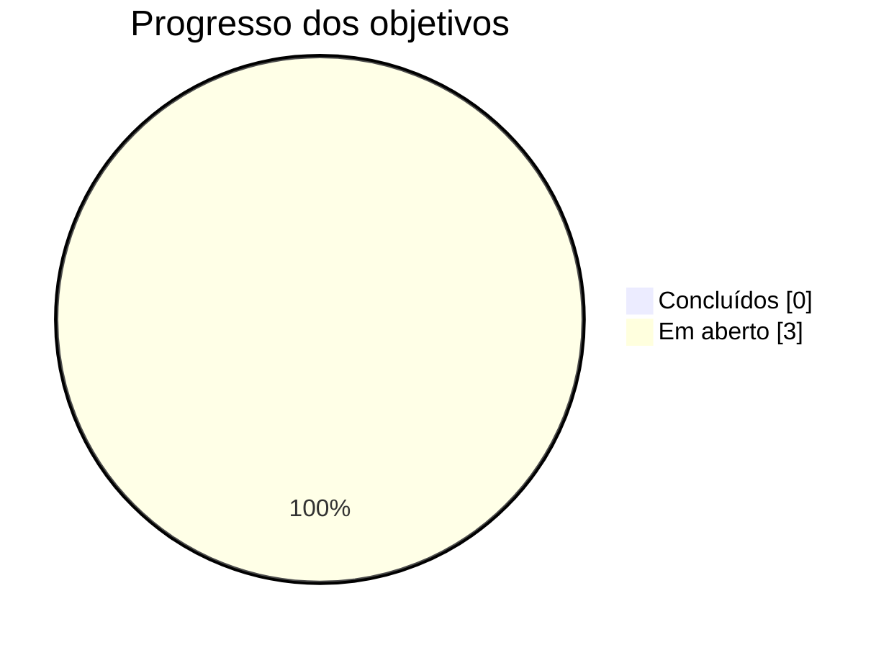

# 🏁 Sprint 00

**Período:** `00/00/2025` → `00/00/2025` &nbsp;·&nbsp; **Status:** 🟢 em andamento

<a href="#-descrição">Descrição</a> •
<a href="#-objetivos">Objetivos</a> •
<a href="#️-reuniões">Reuniões</a> •
<a href="#-finalização">Finalização</a> •
<a href="#-observações">Observações</a>

---

## 📝 Descrição

> A descrição da Sprint deve conter um resumo do que o time se propôs a fazer.

## 🎯 Objetivos

- [ ] Objetivo 1
- [ ] Objetivo 2
- [ ] Objetivo 3

---

## 🗓️ Reuniões

<strong>Reunião 1 — 00/00/2025</strong>

 

| | |
|---|---|
| **Local** | — |
| **Início** | 00:00 |
| **Encerramento** | 00:00 |

**Assuntos**
- Assunto 1
- Assunto 2

<!-- copie o bloco 
 acima para registrar outras reuniões desta sprint -->

---

## 🏆 Finalização

> A Sprint deve ser finalizada com um resumo do que realmente foi feito e quais tarefas foram postergadas para a próxima Sprint.

## 💬 Observações

> Esse espaço deve ser utilizado para registrar qualquer observação que o time julgar pertinente.
